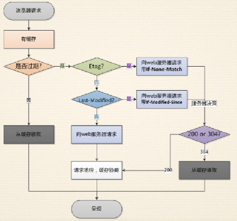

# HTTP协议深入理解

## 网络协议分层

> - 物理层: 定义物理设备如何传输数据(硬件、网线、端口等)
> - 数据链路层: 在通信的实体间建立数据链路连接(软件服务- 010101...)
> - 网络层: 数据在结点之间传输创建逻辑链路(逻辑关系)
> - 传输层: 向用户提供可靠的端到端服务，如TCP、UDP，传输层向高层屏蔽了下层数据通信的细节
> - 应用层: 为应用软件提供服务，如HTTP协议，构建于TCP协议之上

## HTTP发展历史
> - http是超文本传输协议，request和response
> - 目前应用版本: 1.1
> - 默认端口: 80
> - https: 默认端口 443
### http/0.9
> - 只有一个GET命令
> - 没有HEADER等描述数据信息
> - 服务器发送完毕，就关闭TCP连接
### http/1.0
> - 增加了post、header、status code
> - 多字符集支持、多部分发送、权限、缓存等
### http/1.1
> - 持久连接:（不关闭TCP连接）,提高性能
> - pipeline:后一个请求必须在第一个请求发送完毕才能发送
> - host: 在同一台物理服务器可以开启发起多个软件服务器，这样就可以通过host来区分是哪个服务器，比如是java服务还是http服务
### http/2
> - 所有数据以二进制传输
> - 同一个连接里面发送多个请求不再需要按顺序来，也就是并发，解决1.1中pipeline性能低下的问题
> - 头信息压缩以及推送等提高效率的功能

推送的妙处: 在http2之前，请求一个html网页，需要等到html请求过来后解析，然后才能再请求网络资源js、css、图片等，而在2中，在请求html的同时，服务器就并发向客户端推送js、css等文件，这效率NB了

### TCP
> - 3次握手、4次挥手


### URL、URI、URN
> - URI: 统一资源标志符，包含URL和URN
> - URL: 统一资源定位器
`http://kk.com:80/path?query=xxx#hash`
> - URN: 永久统一资源定位符，即使资源移动的位置，还是能找到，目前还未有成熟的应用方案

## http报文

> - 请求方法: GET.POST.HEAD.PUT.DELETE.TRACE.CONNECT.OPTIONS
> - http状态码
```
1xx：表示请求已接收，继续处理
2xx：成功--表⽰请求已被成功接收、理解、接受
3xx：重定向--要完成请求必须进⾏更进⼀步的操作
4xx：客户端错误--请求有语法错误或请求⽆法实现
5xx：服务器端错误--服务器未能实现合法的请求
//------------------------------
200:请求成功
204:请求被受理但没有资源可以返回
206:客户端只请求资源一部分，服务器只对请求的部分资源执行GET方法，报文中通过Conet-Range指定范围的资源
301:永久重定向，百度搜素引擎无法直接搜到https网站，而是网站要弄两个一样的服务，http和https的，百度就将http永久重定向到https
302:临时重定向
303:临时重定向，服务端希望客户端请求URI的时候，通过GET重定向到另一个URI上
304: 发送附带条件的请求时，条件不满足时返回，比如缓存，与重定向无关
307:临时重定向，强制要求使用POST方法
400:请求报文语法有误，服务器无法识别
401:请求需要验证
403:请求的资源禁止被访问
404:服务器找不到相应资源
500:服务器内部错误
503:服务器正忙，超时
```
> - 请求General头
```
Request URL:http://www.sina.com.cn/
Request Method:GET
Status Code:304 Not Modified
Remote Address:219.238.4.9:80
Referrer Policy:unsafe-url
```
> - 常用请求报头
```
Accept: 表示客户端接收那些类型的消息，text/html,image/gif，application/json等
Accept-Encoding:指定可以接收的内容编码，gzip, deflate等
Accept-Language:指定语言，zh-CN,zh等
Authorization:用于证明客户端有权查看摸个资源
Host:指定被请求资源的Internet主句和端口号，www.sina.com.cn
User-Agent:允许客户端将它的操作系统、浏览器和其他属性告诉服务器
Cache-Control:max-age=0
Connection:keep-alive
Cookie:xxx
If-Modified-Since:Sat, 07 Jul 2018 14:00:04 GMT
Referer:https://hao.360.cn/?wd_xp1
```

## 详解http
### http请求命令工具（curl）
> - curl www.baidu.com
> - curl -v www.baidu.com : 详细展示请求报文
### CORS(参考代码cors)
> - Access-Control-Allow-Origin: * 或 xxx.com，允许跨域
> - - 如果允许多个域实现跨域，可以判断request.headers.origin来判断来实现
> - Access-Control-Allow-Headers: xxx, 客户端通过自定义头，向服务器发送预请求，服务器响应后，告知客户端服务器允许通过哪种方式请求，然后客户端可以，例如浏览器是不允许PUT请求的，通过设置Access-Control-Allow-Methods，可以实现
> - Access-Control-Allow-Methods: POST, PUT, DELETE
> - Access-Control-Max-Age:1000 ，告诉浏览器在1000s内不需要再发送预请求进行验证了

### Cache-Control(参考代码cache-control)
> - public: 表示任何地方都可进行缓存，http请求返回内容返回的任何路径包括代理服务器、发起请求的客户端都可以进行缓存的操作，
> - private: 表示只有发起请求的客户端才可以进行缓存操作
> - no-cache: 表示可以缓存，不过每次都需要向服务器发起验证缓存是否可以使用本地缓存
> - max-age: 缓存有效期的秒数
> - s-maxage: 同max-age，专门为代理服务器设置的，(只在代理服务器有效)
> - max-stale: 代表max-age过期后，只要在max-stale秒数内还是可以读取缓存（基本用不到）
> - must-revalidate: max-age过期后，必须重新向服务器请求来验证是否真的过期，而不能直接使用本地缓存（基本用不到）
> - proxy-revalidate: 同must-revalidate，只不过是为代理服务器设计的（基本用不到）
> - no-store: 不允许客户端进行缓存，要区分no-cache
> - no-transform: 同no-store,为代理服务器设计
### 缓存验证(参考代码validation)
> - last-modified:上次修改时间
> - 配合if-modified-since，对比上次修改时间以验证资源是否需要更新
> - Etag: 数据签名,内容修改则数据签名变化，类似hash
> - 配合if-Match或if-none-match，对比资源的签名是否相同
### 浏览器缓存机制


### cookie
> - 通过Set-Cookie设置，浏览器自动保存，在同域中，下次请求会自动带上，键值对形式
> - max-age和expires设置过期时间
> - Secure只在https时发送
> - HttpOnly无法通过document.cookie访问，预防CSRF

**每次请求都会携带cookie，响应也会携带头，这样不好**

### HTTP长连接（参考代码:onnection）
> - connection: keep-alive/close
> - **注意：浏览器的并发限制为6**

### 数据协商（参考代码accept）
> - accept:表示客户端接收那些类型的消息，text/html,image/gif，application/json等
> - accept-encoding:指定可以接收的内容编码，gzip, deflate等
> - Accept-Language:指定语言，zh-CN,zh等
> - User-Agent:允许客户端将它的操作系统、浏览器和其他属性告诉服务器
> - ------------------------------------------------------------------
> - Content-Type
> - Content-Encoding
> - Content-Language：

### 重定向(参考代码redirect)


## Nginx代理服务初探
> - conf/nginx.conf 配置文件
> - include 可以指定多个单独的conf，多个服务的配置就不用都写到nginx.conf，方便管理
```
proxy_cache_path cache levels=1:2 keys_zone=my_cache:10m;
//将缓存放置在nginx目录下的 cache/levels
server {
  listen       80;
  # listen       [::]:80 default_server;
  server_name  test.com;
  # return 302 https://$server_name$request_uri;
  location / {
    proxy_cache my_cache;//设置缓存
    proxy_pass http://127.0.0.1:8888;
    proxy_set_header Host $host;
  }
}
server {
  listen       443 http2;
  server_name  test.com;
  http2_push_preload  on;
  ssl on;
  ssl_certificate_key  ../certs/localhost-privkey.pem;
  ssl_certificate      ../certs/localhost-cert.pem;
  location / {
    proxy_cache my_cache;
    proxy_pass http://127.0.0.1:8888;
    proxy_set_header Host $host;
  }
}
```

### HTTPS 
> - http+ssl 安全版本的HTTP
> - [证书生成命令-测试](https://gist.github.com/Jokcy/5e73fd6b2a9b21c142ba2b1995150808)
> - 加密: 私钥与公钥，对数据进行加密


### HTTP2(参照代码http2)
> - 信道复用: 只需要一次TCP连接即可
> - 分帧传输: 每一帧都包含上下文，这样就不需要数据一定要按照顺序来发送了，即支持并发啦，
> - Server Push: 服务端主动向客户端发送内容
> - nginx配置http2后，nginx可以通过内置的ALPN来衡量客户端是否支持http2(前提要https)


[测试http2性能的网站](https://http2.akamai.com/)